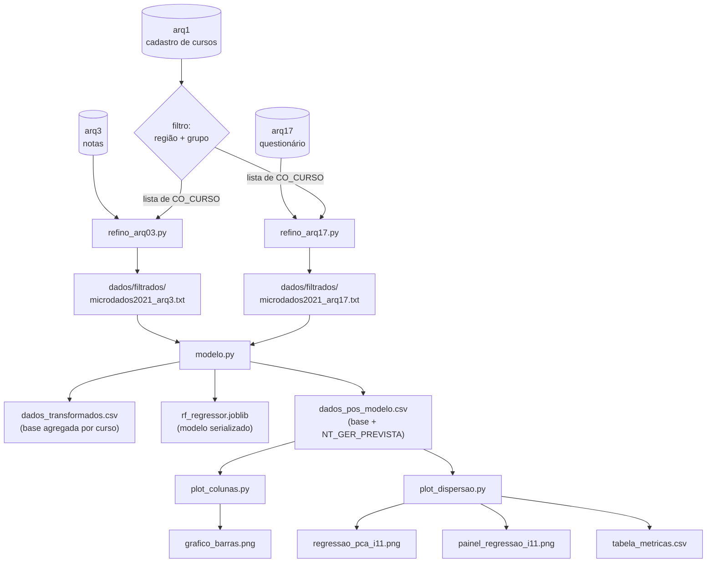

# Eficácia real de bolsas de assistência e auxílio estudantil

Análise do impacto dos programas de bolsa e financiamento (ProUni, FIES, bolsas
institucionais) sobre o desempenho acadêmico, a partir dos microdados do
**Enade 2021** (INEP).

---

## Sumário

1. [Pergunta de pesquisa](#1-pergunta-de-pesquisa)
2. [Dados](#2-dados)
3. [Estrutura do projeto](#3-estrutura-do-projeto)
4. [Instalação](#4-instalação)
5. [Como executar](#5-como-executar)
6. [Como o pipeline funciona](#6-como-o-pipeline-funciona)
7. [Metodologia](#7-metodologia)
8. [Saídas geradas](#8-saídas-geradas)
9. [Limitações e pontos de atenção](#9-limitações-e-pontos-de-atenção)
10. [Próximos passos](#10-próximos-passos)

---

## 1. Pergunta de pesquisa

> Cursos com maior proporção de alunos bolsistas ou financiados apresentam
> desempenho médio no Enade equivalente, superior ou inferior ao de cursos com
> maior proporção de alunos pagantes?

A motivação é avaliar se os recursos destinados à assistência estudantil estão
associados a resultados acadêmicos positivos — informação relevante para o
direcionamento de verbas públicas e institucionais.

> **Atenção à formulação.** A pergunta é sobre **cursos**, não sobre alunos
> individuais. Isso não é uma escolha, é uma imposição dos dados — veja
> [Limitações](#9-limitações-e-pontos-de-atenção).

---

## 2. Dados

**Fonte:** Microdados do Exame Nacional de Desempenho dos Estudantes (Enade) 2021,
versão LGPD, disponibilizados pelo INEP.
<https://www.gov.br/inep/pt-br/acesso-a-informacao/dados-abertos/microdados/enade>

Os microdados vêm divididos em dezenas de arquivos `.txt` (separador `;`,
encoding `latin1`). Este projeto usa três:

| Arquivo | Conteúdo | Papel no pipeline |
|---|---|---|
| `microdados2021_arq1.txt` | Cadastro dos cursos | Define o recorte — quais cursos entram na análise |
| `microdados2021_arq3.txt` | Notas de desempenho | Fornece a variável-alvo `NT_GER` |
| `microdados2021_arq17.txt` | Questionário do Estudante | Fornece a variável explicativa `QE_I11` |

### Variáveis utilizadas

**Do `arq1` (filtro):**

- `CO_CURSO` — código identificador do curso (chave de junção de todo o projeto)
- `CO_REGIAO_CURSO` — região geográfica (`1` = Norte)
- `CO_GRUPO` — código da área/curso (`4004` e `4006` no recorte atual)

**Do `arq3` (alvo):**

- `NT_GER` — nota geral do estudante na prova (0 a 100)

**Do `arq17` (explicativa):**

- `QE_I11` — *"Que tipo de bolsa de estudos ou financiamento do curso você
  recebeu para custear total ou parcialmente as suas despesas?"*

### Dicionário da QE_I11

| Código | Significado |
|---|---|
| `A` | Nenhum, pois meu curso é gratuito |
| `B` | Nenhum, embora meu curso **não** seja gratuito (aluno pagante) |
| `C` | ProUni integral |
| `D` | ProUni parcial, apenas |
| `E` | FIES, apenas |
| `F` | ProUni parcial **e** FIES |
| `G` | Bolsa de governo estadual, distrital ou municipal |
| `H` | Bolsa oferecida pela própria instituição |
| `I` | Bolsa oferecida por outra entidade (empresa, ONG, etc.) |
| `J` | Financiamento oferecido pela própria instituição |
| `K` | Financiamento bancário |

> As categorias `A` e `B` são os grupos de comparação: `A` corresponde na prática
> a instituições públicas e `B` ao aluno pagante de instituição privada.
> As demais (`C`–`K`) são as formas de bolsa/financiamento em avaliação.

> **Nota histórica.** A primeira versão do projeto partiu do
> `microdados2021_arq29.csv`, com a variável `QE_I23`. Essa variável mede
> *horas semanais de estudo fora da sala de aula*, não bolsa — por isso foi
> substituída pela `QE_I11`. O `arq29` não é mais usado pelo pipeline.

---

## 3. Estrutura do projeto

```
.
├── dados/
│   ├── fonte_dados/                       # microdados brutos do INEP (NÃO versionado)
│   │   └── microdados_Enade_2021_LGPD/
│   │       └── 2.DADOS/
│   │           ├── microdados2021_arq1.txt
│   │           ├── microdados2021_arq3.txt
│   │           └── microdados2021_arq17.txt
│   ├── filtrados/                         # saída da etapa de refino
│   │   ├── microdados2021_arq3.txt
│   │   └── microdados2021_arq17.txt
│   └── dados_modelo/                      # saída da etapa de modelagem
│       ├── dados_transformados.csv
│       ├── dados_pos_modelo.csv
│       ├── tabela_metricas.csv
│       └── rf_regressor.joblib
├── plotagens/                             # gráficos gerados
│   ├── grafico_barras.png
│   └── regressao_pca_i11.png
│
├── util_etl.py                            # funções compartilhadas de leitura/junção
├── refino_arq03.py                        # ETL do arquivo de notas
├── refino_arq17.py                        # ETL do arquivo de questionário
├── modelo.py                              # agregação, treino e predição
├── plot_colunas.py                        # gráfico de barras por categoria
├── plot_dispersao.py                      # PCA, painel de regressões e métricas
│
├── DIARIO.md                              # diário de decisões do grupo
├── README.md
├── requirements.txt
└── .gitignore
```

> Os microdados brutos **não são versionados** (`.gitignore` ignora
> `dados/fonte_dados`). Baixe o pacote do INEP e descompacte nesse caminho antes
> de rodar qualquer coisa.

---

## 4. Instalação

Requer **Python 3.12+** (o código usa f-strings com aspas aninhadas).

### Criar e ativar o ambiente virtual

**Linux / macOS (bash, zsh):**

```bash
python3 -m venv .venv
source .venv/bin/activate
```

**Windows (PowerShell):**

```powershell
python -m venv .venv
.venv\Scripts\Activate.ps1
```

> Se o PowerShell recusar com *"a execução de scripts foi desabilitada neste
> sistema"*, libere apenas para a sessão atual e tente de novo:
> ```powershell
> Set-ExecutionPolicy -Scope Process -ExecutionPolicy Bypass
> ```

**Windows (Prompt de Comando / cmd):**

```bat
python -m venv .venv
.venv\Scripts\activate.bat
```

O ambiente está ativo quando o prompt passa a exibir o prefixo `(.venv)`.
Para confirmar:

```
python -c "import sys; print(sys.prefix)"
```

A saída deve apontar para a pasta `.venv` dentro do projeto. Se apontar para a
instalação global do Python, o ambiente **não** está ativo — e o `pip install`
abaixo vai instalar as dependências no lugar errado.

### Instalar as dependências

```
pip install -r requirements.txt
```

Dependências principais: `pandas`, `numpy`, `scikit-learn`, `matplotlib`,
`seaborn`, `joblib`.

### Preparação das pastas

O código escreve em diretórios que precisam existir previamente.

**Linux / macOS:**

```bash
mkdir -p dados/filtrados dados/dados_modelo plotagens
```

**Windows (PowerShell):**

```powershell
mkdir dados\filtrados, dados\dados_modelo, plotagens -Force
```

---

## 5. Como executar

Os scripts são **sequenciais e dependentes**. Rode nesta ordem:

```bash
# 1. Refino — filtra o universo de cursos e reduz os arquivos gigantes
python refino_arq03.py
python refino_arq17.py

# 2. Modelagem — agrega por curso, treina o Random Forest e gera as predições
python modelo.py

# 3. Visualização — gera os gráficos e a tabela de métricas
python plot_colunas.py
python plot_dispersao.py
```

Cada script tem um bloco `if __name__ == "__main__":` no final, onde os caminhos
de entrada estão fixados. Ajuste ali se sua estrutura de pastas for diferente.

### Flags úteis

`modelo.py` expõe alguns interruptores nas assinaturas das funções:

| Flag | Onde | O que faz |
|---|---|---|
| `flag_exe_treino` | `main_modelo` | Se `False`, pula o treino e apenas carrega o `.joblib` existente |
| `teste_mdl` | `treinar_e_salvar_modelo` | Imprime R², MAE, RMSE e a importância das variáveis |
| `teste_par` | `treinar_e_salvar_modelo` | Roda `GridSearchCV` para buscar hiperparâmetros (lento) |
| `print_flag` | várias | Imprime `head()`, `info()` e `describe()` do DataFrame |

---

## 6. Como o pipeline funciona



### `util_etl.py` — camada de leitura

| Função | O que faz |
|---|---|
| `leitura_inicial_dados(caminho, colunas_manter, dic_de_tipagem, print_flag)` | Lê um CSV/TXT com `sep=";"`, `encoding="latin1"` e `dtype=str`. Opcionalmente seleciona colunas e aplica um dicionário de tipos. |
| `show_df(df)` | Imprime `head()`, `info()` e `describe()` para inspeção rápida. |
| `juncao(df1, df2, coluna, print_flag)` | Inner join genérico por uma coluna. |

Tudo é lido como **string** por padrão e convertido depois — escolha deliberada
para evitar que o pandas infira tipos errados nos códigos numéricos do INEP
(que são identificadores, não números).

### `refino_arq03.py` e `refino_arq17.py` — etapa de recorte

Ambos seguem o mesmo roteiro:

1. Lê o `arq1` mantendo apenas `CO_CURSO`, `CO_REGIAO_CURSO` e `CO_GRUPO`.
2. Filtra os cursos do recorte (região Norte, grupos `4004` e `4006`) e extrai a
   lista de `CO_CURSO` resultante.
3. Lê o arquivo grande (`arq3` ou `arq17`) inteiro.
4. Mantém apenas as linhas cujo `CO_CURSO` está na lista.
5. Insere uma coluna `id` com um UUID por linha.
6. Salva o resultado em `dados/filtrados/`.

O `refino_arq03.py` adicionalmente aplica um dicionário de tipagem
(`dic_tipagem`) convertendo as colunas `NU_ITEM_*` para `int` e todas as `NT_*`
para `float`.

O objetivo da etapa é simples: os arquivos originais têm centenas de milhares de
linhas; depois do refino cabem confortavelmente na memória e nas etapas seguintes.

### `modelo.py` — agregação, treino e predição

**`preparar_dados_regressao(df_arq3, df_arq17)`** — o coração da transformação.

Lado das notas (`arq3`):

```
CO_CURSO + NT_GER
  → to_numeric (coerce)
  → remove nulos e notas iguais a zero
  → groupby(CO_CURSO)
      NT_GER    = média das notas do curso
      QT_ALUNOS = contagem de alunos com nota válida
```

Lado do perfil (`arq17`):

```
CO_CURSO + QE_I11
  → dropna
  → normaliza a string (strip + upper)
  → get_dummies  → 11 colunas binárias QE_I11_A … QE_I11_K
  → groupby(CO_CURSO).mean()
```

O `.mean()` sobre colunas binárias é o truque central: ele converte as dummies
na **proporção de alunos do curso em cada categoria de bolsa**. Um curso onde
30% dos respondentes têm ProUni integral fica com `QE_I11_C = 0.30`.

Por fim, um **inner join** por `CO_CURSO`. A base resultante tem uma linha por
curso:

| CO_CURSO | NT_GER | QT_ALUNOS | QE_I11_A | QE_I11_B | … | QE_I11_K |
|---|---|---|---|---|---|---|
| 1332837 | 42.7 | 58 | 0.00 | 0.41 | … | 0.03 |

**`treinar_e_salvar_modelo(df, fatia_treino, caminho_modelo, ...)`**

- `X` = as 11 proporções (descarta `CO_CURSO`, `NT_GER`, `QT_ALUNOS`)
- `y` = `NT_GER` (média do curso)
- `sample_weight` = `QT_ALUNOS`

O peso é importante: sem ele, um curso com 8 alunos teria o mesmo impacto no
treino que um com 300. O `train_test_split` divide os pesos junto com X e y.

Modelo: `RandomForestRegressor(n_estimators=200, max_depth=5,
min_samples_split=10, min_samples_leaf=1, random_state=42)`. A profundidade
limitada a 5 é uma defesa contra overfitting, já que a base agregada tem poucas
linhas (uma por curso).

O modelo treinado é serializado com `joblib.dump`.

**`aplicar_modelo(df, caminho_modelo)`** — recarrega o `.joblib`, prevê sobre a
base e adiciona a coluna `NT_GER_PREVISTA`.

**Funções auxiliares:**

| Função | Para que serve |
|---|---|
| `avaliar_modelo` | R², MAE, RMSE no conjunto de teste + `feature_importances_` ordenadas |
| `comparar_algoritmos` | Treina um `LinearRegression` com os mesmos dados e compara R² e RMSE lado a lado com o Random Forest |
| `teste_de_parametros` | `GridSearchCV` com validação cruzada (5 folds) sobre uma grade de `n_estimators`, `max_depth`, `min_samples_split` e `min_samples_leaf` |

### `plot_colunas.py` — desempenho por categoria de bolsa

1. Faz *melt* (unpivot) das 11 colunas `QE_I11_*` — a base vai de "uma linha por
   curso" para "uma linha por curso × categoria".
2. Estima o número absoluto de alunos em cada célula:
   `Alunos_Estimados = QT_ALUNOS × Proporcao`.
3. Descarta células com zero aluno.
4. Agrupa por categoria calculando a **média ponderada** da nota, usando
   `Alunos_Estimados` como peso.
5. Desenha um gráfico de barras A–K com os valores anotados no topo.

### `plot_dispersao.py` — três análises

**`preparar_dados_pca` + `plotar_grafico_dispersao`** — aplica PCA reduzindo as
11 proporções a **um único componente** (`INDICE_PCA_I11`), um "índice sintético
de perfil de financiamento do curso". Plota esse índice contra a nota, com linha
de tendência. Imprime no terminal o percentual da variância total que o
componente resume.

**`plotar_painel_regressao`** — grade 3×4 com 11 gráficos de regressão, um por
categoria: proporção de alunos na categoria (eixo X, 0 a 1) contra a nota
(eixo Y). Mostra o efeito isolado de cada tipo de bolsa.

**`exibir_tabela_metricas_regressao`** — para cada categoria, ajusta uma
regressão linear simples e reporta R², MAE e RMSE. É a contraparte numérica do
painel: quantifica quanto cada categoria, sozinha, explica da variação nas notas.

---

## 7. Metodologia

**Unidade de análise:** o **curso** (`CO_CURSO`), não o aluno.

**Variável dependente:** média da `NT_GER` dos alunos do curso.

**Variáveis independentes:** as 11 proporções de categorias da `QE_I11`.

**Ponderação:** número de alunos com nota válida por curso, aplicado tanto no
treino do modelo quanto nas médias dos gráficos.

**Limpeza aplicada:**

- Notas nulas ou iguais a zero são removidas (zeros em geral correspondem a
  alunos presentes que entregaram a prova em branco).
- Respostas ausentes na `QE_I11` são removidas antes da agregação.
- Strings da `QE_I11` são normalizadas (`strip` + `upper`) para evitar categorias
  duplicadas por diferença de formatação.

**Divisão treino/teste:** 80/20, `random_state=42`.

**Métricas:** R² (poder explicativo), MAE (erro absoluto médio) e RMSE (erro
quadrático médio — penaliza erros grandes). O Random Forest é comparado com uma
Regressão Linear como baseline.

---

## 8. Saídas geradas

| Arquivo | Gerado por | Conteúdo |
|---|---|---|
| `dados/filtrados/microdados2021_arq3.txt` | `refino_arq03.py` | Notas dos cursos do recorte |
| `dados/filtrados/microdados2021_arq17.txt` | `refino_arq17.py` | Respostas do questionário no recorte |
| `dados/dados_modelo/dados_transformados.csv` | `modelo.py` | Base agregada por curso (antes da predição) |
| `dados/dados_modelo/rf_regressor.joblib` | `modelo.py` | Modelo Random Forest serializado |
| `dados/dados_modelo/dados_pos_modelo.csv` | `modelo.py` | Base agregada + coluna `NT_GER_PREVISTA` |
| `dados/dados_modelo/tabela_metricas.csv` | `plot_dispersao.py` | R², MAE e RMSE por categoria da QE_I11 |
| `plotagens/grafico_barras.png` | `plot_colunas.py` | Nota média ponderada por categoria |
| `plotagens/regressao_pca_i11.png` | `plot_dispersao.py` | Índice PCA × nota, com tendência |
| `painel_regressao_i11.png` | `plot_dispersao.py` | Painel 3×4 com as 11 regressões isoladas |

> O painel é salvo na **raiz do projeto**, não em `plotagens/` — o valor padrão
> do parâmetro `nome_arquivo` em `plotar_painel_regressao` não tem prefixo de
> pasta.

---

## 9. Limitações e pontos de atenção

Esta seção é parte do resultado, não um apêndice. Quem for interpretar os
gráficos precisa ler isto antes.

### 9.1 Inferência ecológica (limitação estrutural)

A versão **LGPD** dos microdados separa notas e respostas de questionário em
arquivos distintos **sem uma chave que ligue o mesmo aluno entre eles** — é a
estratégia de anonimização do INEP. A única junção possível é por `CO_CURSO`.

Consequência direta: **não é possível comparar bolsista e pagante
individualmente.** O que se compara são cursos com diferentes composições de
financiamento. Concluir algo sobre alunos a partir disso é
[falácia ecológica](https://pt.wikipedia.org/wiki/Falácia_ecológica). Toda
conclusão do trabalho deve ser enunciada no nível do curso.

*(A coluna `id` com UUID criada no refino é apenas um identificador de linha —
aleatório, não serve como chave de junção entre arquivos.)*

### 9.2 Confundimento por natureza administrativa da instituição

A categoria `A` ("curso gratuito") identifica, na prática, **instituições
públicas**. Cursos públicos têm média de Enade mais alta por razões que nada têm
a ver com bolsa: seletividade de ingresso, dedicação exclusiva do corpo docente,
infraestrutura de pesquisa.

Se o modelo apontar `QE_I11_A` como a variável mais importante, isso **não**
significa "não ter bolsa melhora o desempenho" — significa que a variável está
funcionando como proxy de "instituição pública".

O contraste que de fato responde à pergunta do projeto é, **dentro das
instituições privadas**, comparar cursos com alta proporção de `C` (ProUni
integral) contra cursos com alta proporção de `B` (pagante). Aí os dois grupos
compartilham instituição, curso e condições de ensino.

### 9.3 Colinearidade perfeita entre as proporções

Por construção, `QE_I11_A + QE_I11_B + … + QE_I11_K = 1` em todo curso. Isso é
dado composicional, e tem duas implicações:

- Na regressão linear, os coeficientes não são identificáveis individualmente.
  Para interpretá-los é preciso **eliminar uma categoria de referência** (o
  candidato natural é `B`) e ler os demais coeficientes como desvios em relação
  a ela.
- No PCA sem padronização, o primeiro componente tende a ser dominado pela
  categoria de maior variância. Verifique se o `INDICE_PCA_I11` não é apenas um
  reflexo de `QE_I11_A`.

### 9.4 Predição sobre a base completa

`aplicar_modelo` prevê sobre **todo** o `df_consolidado`, incluindo os 80%
usados no treino. A coluna `NT_GER_PREVISTA` é, em boa parte, ajuste *in-sample*.
Para afirmações sobre capacidade de generalização, use as métricas do conjunto
de teste (`avaliar_modelo` com `teste_mdl=True`).

### 9.5 Os gráficos analisam a predição, não a nota real

`plot_colunas.py` e `plot_dispersao.py` usam `NT_GER_PREVISTA` no eixo Y. Isso
mede **como o Random Forest usa seus próprios inputs**, não a relação observada
nos dados. Como o modelo já suavizou o ruído, os R² da `tabela_metricas.csv`
ficam artificialmente altos.

A coluna `NT_GER` real está disponível no mesmo DataFrame. Para análise
substantiva, use ela. Reserve `NT_GER_PREVISTA` para o gráfico de
"previsto × observado", que é o uso legítimo da predição.

### 9.6 Denominadores diferentes

`QT_ALUNOS` conta alunos com **nota válida** (vindo do `arq3`), enquanto as
proporções são calculadas sobre alunos que **responderam ao questionário**
(vindo do `arq17`). São subconjuntos distintos do mesmo curso. O produto
`Alunos_Estimados = QT_ALUNOS × Proporcao` em `plot_colunas.py` é, portanto, uma
aproximação.

### 9.7 Bug conhecido — filtro de região inativo

Em `refino_arq03.py` e `refino_arq17.py`, linhas 6–8, os três filtros partem
todos de `dataf_inicial_arq1`, então apenas o **último** sobrevive. O `dropna` e
o filtro `CO_REGIAO_CURSO == "1"` (Norte) são silenciosamente descartados — o
recorte efetivo é **Brasil inteiro**, restrito aos grupos `4004` e `4006`.

Correção:

```python
df = dataf_inicial_arq1.dropna(how="all")
df = df[df["CO_REGIAO_CURSO"] == "1"]
df = df[df["CO_GRUPO"].isin(["4004", "4006"])]
dataf_final_arq1 = df["CO_CURSO"]
```

### 9.8 Outros pontos menores

- `teste_de_parametros` retorna o melhor estimador, mas o valor é descartado
  pelo chamador — o `GridSearchCV` não altera os hiperparâmetros usados.
- `comparar_algoritmos` é chamado incondicionalmente dentro de
  `treinar_e_salvar_modelo` e retreina um Random Forest idêntico do zero.
- `os.makedirs(os.path.dirname(caminho_modelo))` falha se o caminho não tiver
  diretório (o valor padrão `'rf_regressor2.joblib'` cai nesse caso).
- Os arquivos são escritos em UTF-8 (padrão do `to_csv`) e relidos com
  `encoding="latin1"`. Funciona porque não há acentos nos dados, mas é frágil.
- `tabela_metricas.csv` usa separador `,` enquanto todo o resto usa `;`.
- O parâmetro `fatia_treino` é passado como `test_size` — o nome sugere o oposto
  do que faz.
- Confirme o separador decimal da `NT_GER` no arquivo do INEP. Se for vírgula,
  o `pd.to_numeric(..., errors='coerce')` converte tudo para `NaN` **em
  silêncio** e a base fica vazia.

---

## 10. Próximos passos

- [ ] Corrigir o filtro de região e fixar o recorte definitivo do estudo
- [ ] Trocar `NT_GER_PREVISTA` por `NT_GER` nos gráficos analíticos
- [ ] Incorporar `CO_CATEGAD` (categoria administrativa) do `arq1` para separar
      pública × privada e neutralizar o confundimento da seção 9.2
- [ ] Adotar regressão linear ponderada com categoria de referência como modelo
      principal (coeficientes interpretáveis) e manter o Random Forest como teste
      de robustez
- [ ] Ativar `teste_mdl=True` e reportar métricas do conjunto de teste
- [ ] Publicar o gráfico de `feature_importances_` do modelo
- [ ] Redigir a seção de limitações do relatório a partir da seção 9 deste README

---

## Diário de decisões

O histórico cronológico das decisões do grupo está em [`DIARIO.md`](DIARIO.md).
